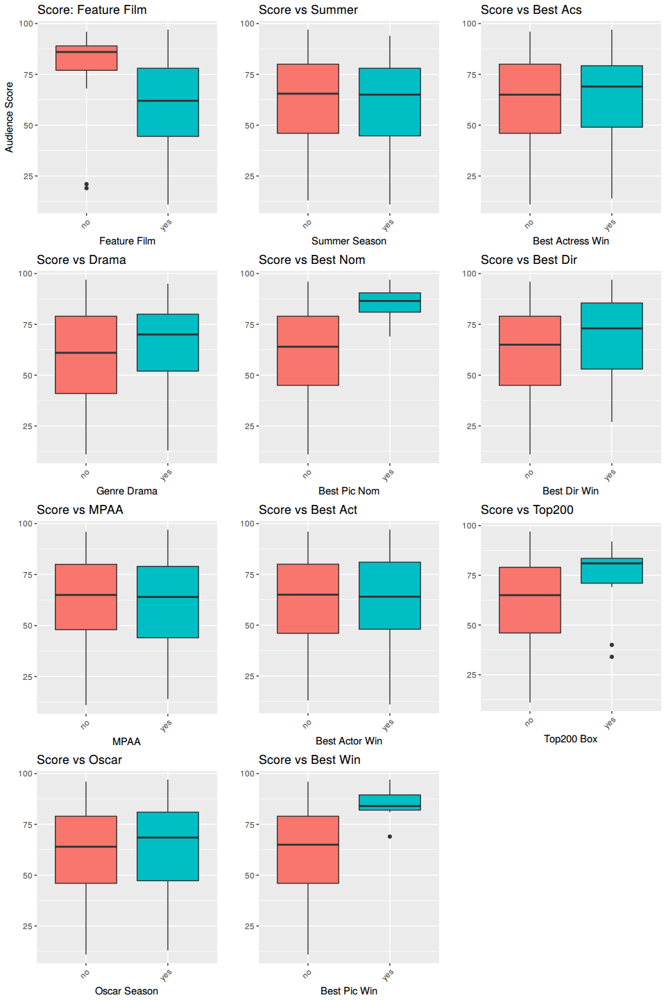
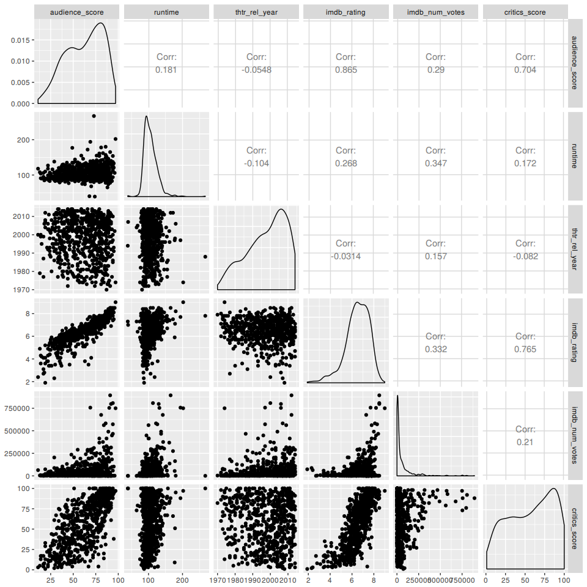
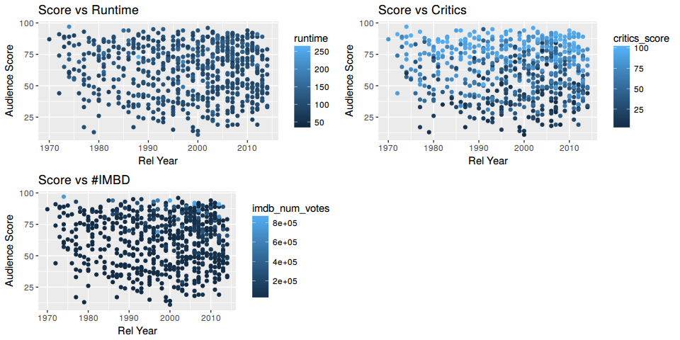
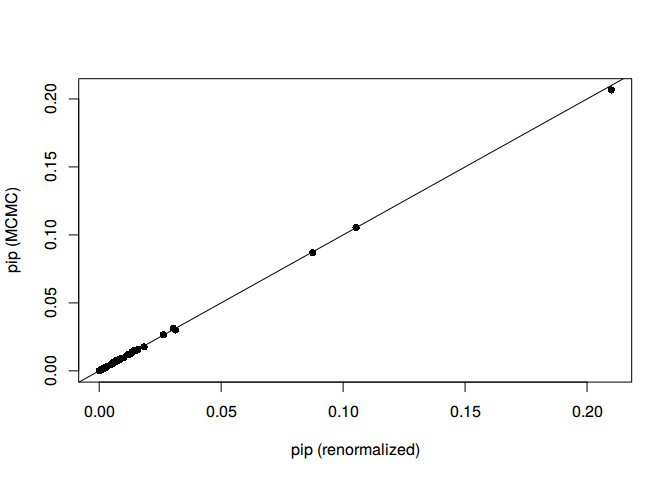
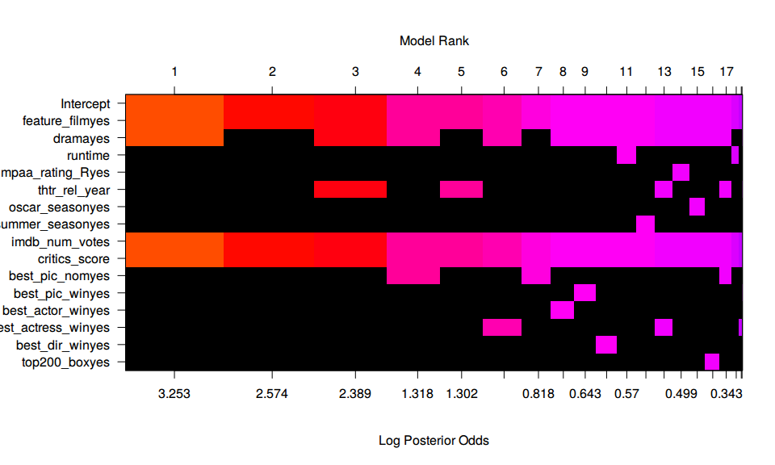
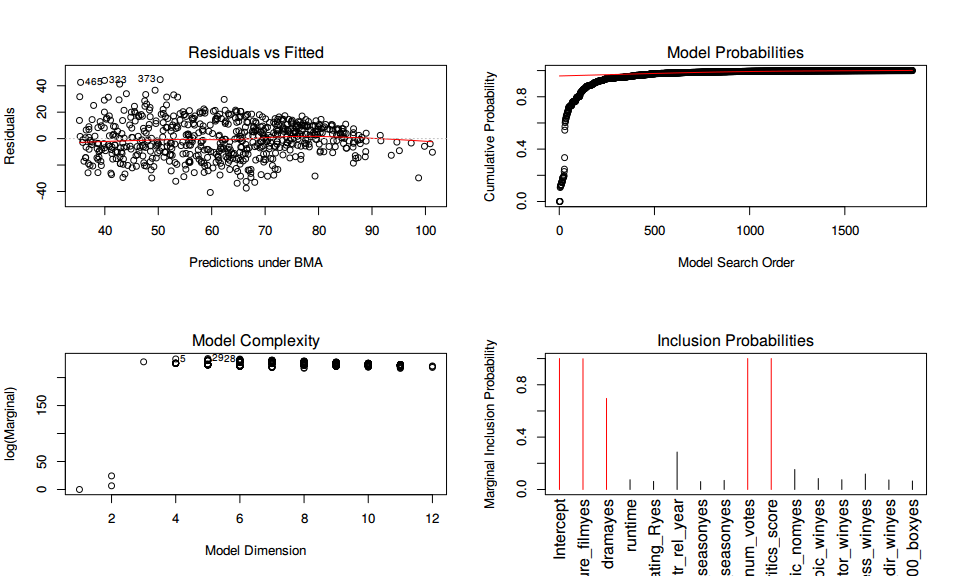
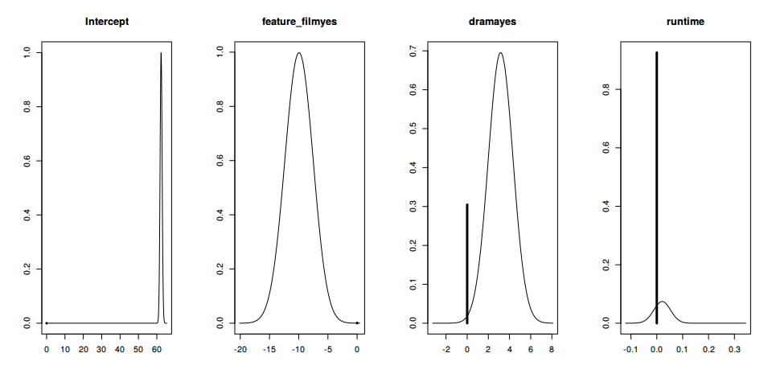
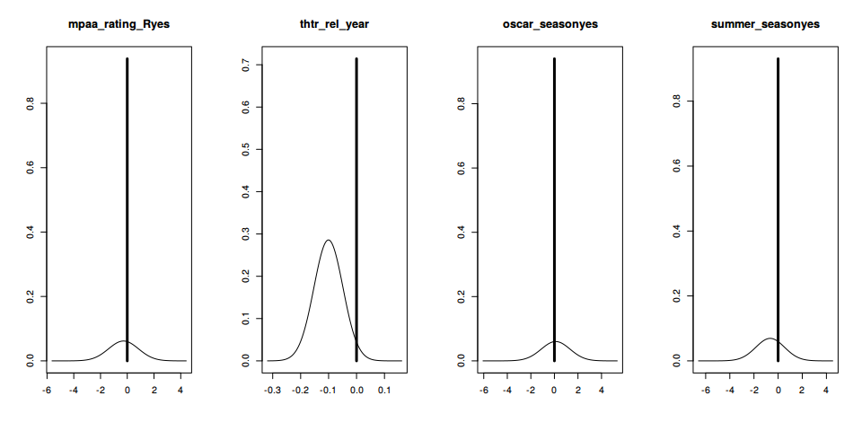
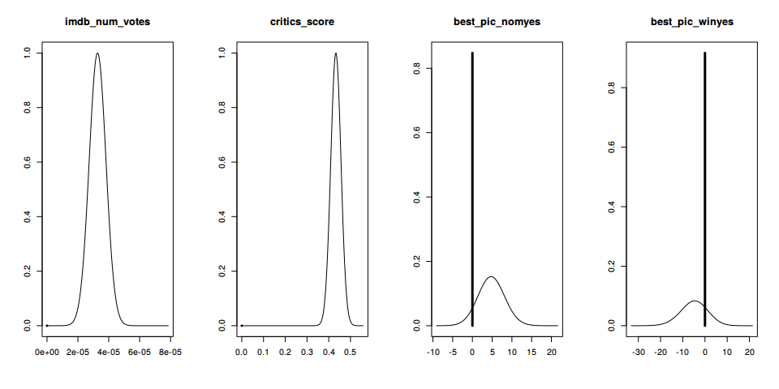
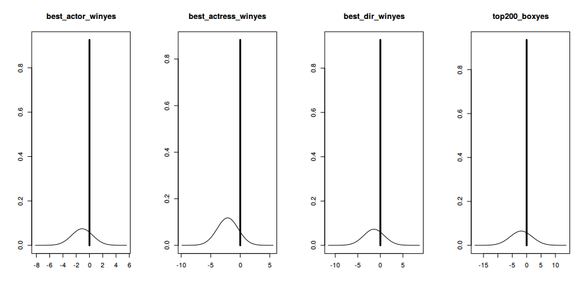

Bayesian modeling and prediction for movies
================

### Load packages

    ## Loading required package: ggplot2

``` r
library(ggplot2)
library(dplyr)
library(statsr)
library(BAS)
library(grid)
library(gridExtra)
suppressMessages(library(GGally))
```

### Load data

``` r
setwd("~/coursera/bayesian-movie-prediction")
load("movies.Rdata")
```

Part 1: Data
------------

The data set is comprised of 651 randomly sampled movies produced and released before 2016. The data comes from Rotten Tomatoes and IMDb. Additionally there are further descriptive variables like actors, directors and release dates. The data is not a complete list of movies released before 2016. Its only a subset taken form the full data set. There is no information provided regarding the sampling method used to obtain the set.

For this analysis it is assumed that the observations are independent and evenly distributed. The count of the movies of 651 is far below the 10% of the population threshold for independence. Even the ggplot2 movies data set has ~30000 observations about movies. The sample was obtained randomly from existing data, so one can generalize to the population as a whole but we cannot infer causality since this is a observational study.

Some of these variables are only there for informational purposes and do not make any sense to include in a statistical analysis. Based on the research question one will omit certain observations or restructure some of the variables to make them suitable for answering.

Part 2: Data manipulation
-------------------------

For the analysis lets create some categorical variables to assist us in exploring the data.

``` r
movies <- movies %>% 
          mutate(feature_film=as.factor(ifelse(title_type == 'Feature Film', 'yes', 'no'))) %>%
          mutate(drama=as.factor(ifelse(genre == 'Drama', 'yes', 'no'))) %>%
          mutate(mpaa_rating_R=as.factor(ifelse(mpaa_rating == 'R', 'yes', 'no'))) %>%
          mutate(oscar_season=as.factor(ifelse(thtr_rel_month %in% c(10:12), 'yes', 'no'))) %>%
          mutate(summer_season=as.factor(ifelse(thtr_rel_month %in% c(5:8), 'yes', 'no')))
```

Now extract only the needed variables for modelling.

``` r
m <- subset(movies, select = c(
               audience_score, feature_film, drama, runtime, mpaa_rating_R, thtr_rel_year, oscar_season, summer_season, imdb_rating, 
              imdb_num_votes, critics_score, best_pic_nom, best_pic_win, best_actor_win, best_actress_win, best_dir_win, top200_box
                ))
```

Examine if there are NA's and omit them in the analysis.

``` r
M <- sapply(m, function(x) sum(is.na(x))); M[M>0]
```

    ## runtime 
    ##       1

There is one observation where the runtime is not available, filter the NA and update the data set.

``` r
m <- filter(m, !is.na(runtime))
```

Part 3: Exploratory data analysis
---------------------------------

First focus on the categorical variables and print the corresponding boxplots, to see we can see a pattern in first place. 

It looks like that there are 4 variables that have an "impact" on the audience\_score at first sight. Namely: feature\_film, best\_pic\_nom, top200\_box and best\_pic\_win. These circumstances will be further examined at the modelling phase. Lets check the numerical variables left. First check for collinearity.

``` r
ggpairs(m, columns = c(1,4,6,9,10,11) )
```

 The imdb\_rating is highly correlated r=0.865 with the audience\_score. Collinearity can change the coefficient estimates erratically in response to small changes in the model or the data. Remove imdb\_rating from the data set. Another common way to check for collinearity is with variance infalction factors ('vif' function in 'car'). Applying 'vif' to the model gives 'aliased coefficients' which means that variables are collinear.

``` r
m <- subset(m, select = -c(imdb_rating))
```

Now plot the audience\_score against thtr\_rel\_year since it has the lowest correlation and color piecewise runtime, imdb\_num\_votes and critics\_score to see one can register a color pattern.



The only pattern visible is for 'critics\_score' most of the time when 'critics\_score' rises the 'audience\_score' rises too, which is also evident in the correlation factor of 0.7. Checking with 'vif' there are no more aliased coefficients and thats why we leave 'critics\_score' as a describing variable for the model.

Part 4: Modeling
----------------

``` r
bm <- bas.lm(audience_score ~ ., data=m, method='MCMC',
             prior='ZS-null', 
             modelprior=uniform(), initprobs="eplogp")
```

``` r
diagnostics(bm, type="model",  pch=16)
```



The two estimators are in pretty close agreement. The plot of the model probabilites suggests that one should use more MCMC.iterations if more accurate estimates of the posterior model probabilities are needed. Therefore set the iterations to MCMC.iterations=10^6 and check again.

``` r
bm <- bas.lm(audience_score ~ ., data=m, method='MCMC',  MCMC.iterations = 10^6,
             prior='ZS-null', 
             modelprior=uniform(), initprobs="eplogp")
```

``` r
diagnostics(bm, type="model",  pch=16)
```


The estimators are now more close to the line than before, 10^6 iterations for this model space is enough. Lets examine the collection of models.

``` r
image(bm, rotate=F)
```



According to the picture above the best model is the one including 'feature\_film', 'drama', 'imdb\_num\_votes' and 'critics\_score'. Additionally plot some graphical summaries of the output.

``` r
par(mfrow=c(2,2))
plot(bm, ask=F)
```



The 'Residuals vs. Fitted' plot shows residuals centered around zero and almost constant variation. There are no outliers, so we can assume that the model is doing pretty good.

The 'Model Probabilites' plot shows the cumulative probability of the models and is leveling off at 1000 number of samples and sampling stops at 2000 samples as no additional models adds a increment to the cumulative probability.

The “Model Complexity” plot shows that the highest log marginal can be reached from 2 to 14 dimensions.

Last but not least the 'Inlucsion Probabilites' plot shows the marginal posterior inclusion probabilities (pip) for each of the covariates. As already seen in the model space plot, the variables for inclusion match

``` r
par(mfrow=c(1,4))
plot(coefficients(bm), ask=F)
```

 The vertical bar represents the posterior probability that the coefficient is 0 while the bell shaped curve represents the density of plausible values from all the models where the coefficient is non-zero. Concluding most of the coefficient can be excluded from the model excepting the coefficient mentioned above, which have not vertical bar and have a distribution with altitudes of almost 1.0.

Part 5: Prediction
------------------

For prediction the blockbuster movie Mad Max Fury Road will be used to test the model.

``` r
madmax <- data.frame(
  audience_score=0,
  feature_film=factor("yes", levels=c("no", "yes")),
  drama=factor("no", levels=c("no", "yes")),
  runtime=120, 
  mpaa_rating_R=factor("yes", levels=c("no", "yes")),
  thtr_rel_year=2015,
  oscar_season=factor("yes", levels=c("no", "yes")),
  summer_season=factor("yes", levels=c("no", "yes")),
  imdb_num_votes=584601,
  critics_score=97, 
  best_pic_nom=factor("yes", levels=c("no", "yes")),
  best_pic_win=factor("no", levels=c("no", "yes")),
  best_actor_win=factor("no", levels=c("no", "yes")),
  best_actress_win=factor("no", levels=c("no", "yes")),
  best_dir_win=factor("no", levels=c("no", "yes")),
  top200_box=factor("yes", levels=c("no", "yes"))
)
p <- predict(bm, newdata=madmax, estimator="BMA", se.fit=TRUE)

p$fit
```

    ##          [,1]
    ## [1,] 94.84819

The predicted value is 94.8481938 in comparison to the true values of 84, the model predicted compared to the true value with an error of 10.28%.

Part 6: Conclusion
------------------

A linear regression model using bayesian model averaging was created which has some potential to predict the movie audience\_score based on the given coefficients. To improve the model more data is needed and the inclusion of maybe other coefficients that are not included in this data set. The further improvement of this model goes beyond of the scope of this assignment.
